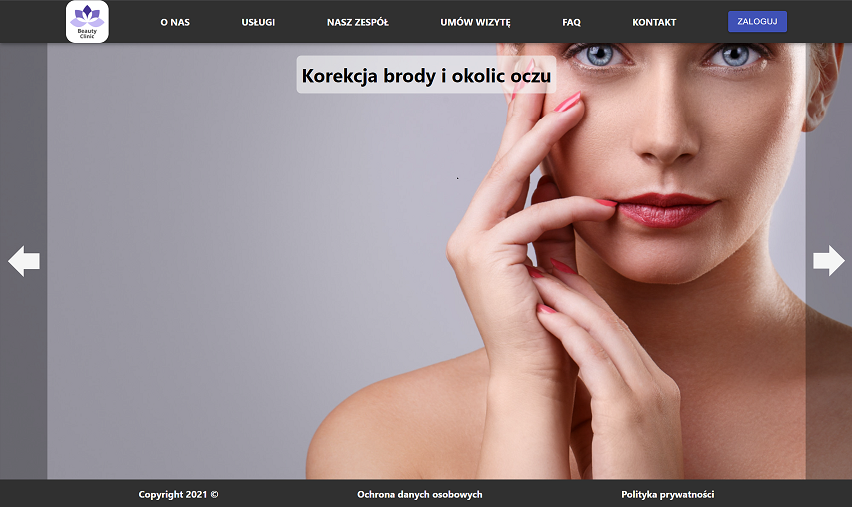

# Beauty Clinic Project

Link to live demo -> [Beauty Clinic](https://amazing-pasteur-4c1568.netlify.app "Beauty Clinic")

### **Table of Contents**
- [The Goal](#the-goal)
- [Technologies](#technologies-we-use)
- [Screenshot](#sample-screenshot)

## The Goal
The goal of this project is to create a landing page of beauty clinic website with the following features:
- Login page and user profile
- Booking an appointment as guest and logged-in user
- Distinction between type of logged-in user (patient, doctor, admin) which would determine privileges to create/edit/cancel appointment

## Technologies we use
- Front: React.js
- Backend: Spring Boot, Spring Data, Maven, Docker
Hosting-Heroku, PostgreSQL, Flyway, Spring Security

## Sample Screenshot

